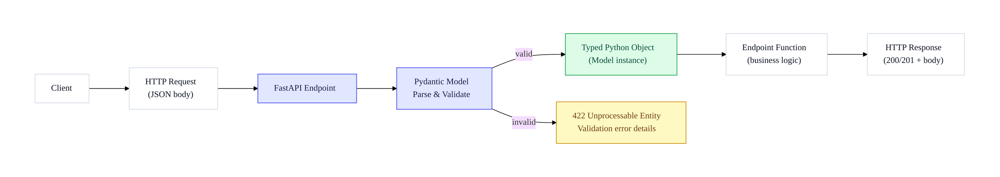
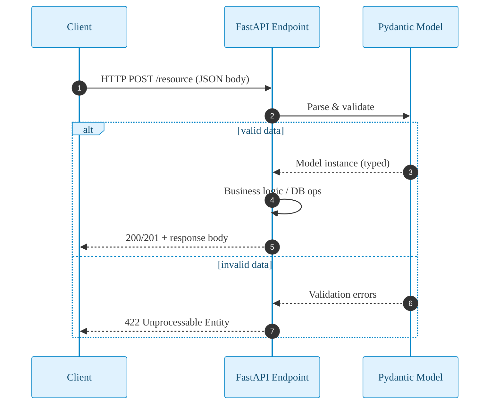

# FastAPI — Request Body (Flow)

Notes
- Request body is JSON sent by the client to FastAPI.
- Pydantic validates and parses on the server.
- Invalid data returns a clear 422 error response.
- Valid data becomes a typed model instance used by your handler.

## Sequence — Validation Path

