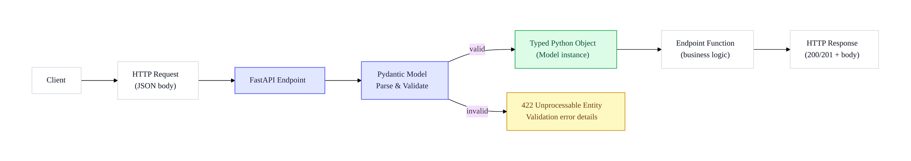

# Request Body:
 The data sent by the client to your FastAPI app in an HTTP request (often in JSON format).

The main reason for using Pydantic in FastAPI is to validate and parse incoming data (usually from API requests) on the server side.

- Validation happens on the server, when an HTTP request hits your FastAPI endpoint.
- Pydantic checks if the incoming data matches your schema (fields, types, required/optional).
- If the data is invalid, FastAPI automatically returns a clear error message to the client.
- If valid, your function receives a clean, typed Python object, ready for use.

## Diagram — Request Body Flow

