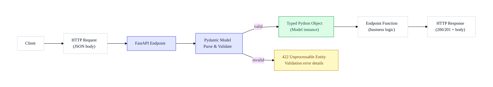
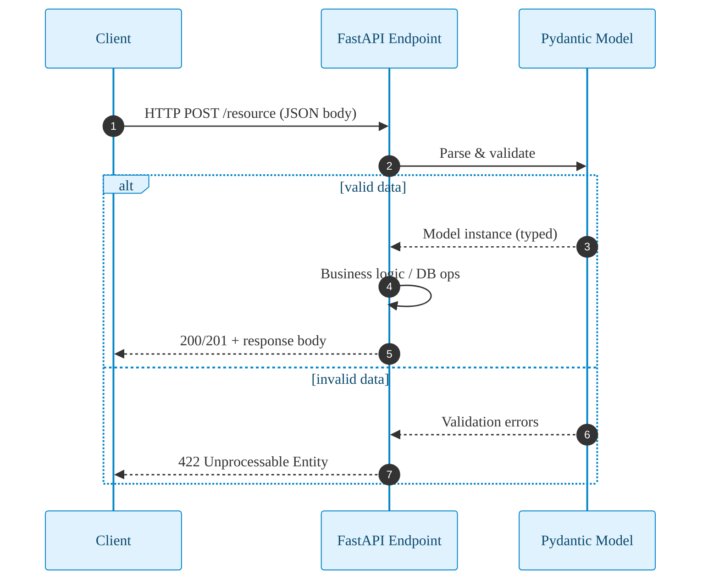

# Request Body:
- **Request Body vs. Response Body:**
  A *request body* contains data sent by the client to the API (commonly with POST, PUT, DELETE, or PATCH methods). A *response body* is data sent from the API back to the client.

- **Declaring Request Bodies:**
  Request bodies are declared as Python classes that inherit from Pydantic's `BaseModel`.
  Example model:
  ```python
  from pydantic import BaseModel

  class Item(BaseModel):
      name: str
      description: str | None = None
      price: float
      tax: float | None = None
  ```
  The model defines data validation automatically and supports optional fields by setting defaults to `None`.

- **Using in Path Operations:**
  You add the model as a parameter in your path operation function. FastAPI then:
  - Reads and parses incoming JSON payloads.
  - Validates and converts fields to the correct types.
  - Provides clear error messages if data is missing or incorrect.
  - Generates JSON schemas for the models, included in auto-generated OpenAPI docs.
  - Provides editor support (type hints, autocompletion) when using Pydantic models.

The main reason for using Pydantic in FastAPI is to validate and parse incoming data (usually from API requests) on the server side.

- Validation happens on the server, when an HTTP request hits your FastAPI endpoint.
- Pydantic checks if the incoming data matches your schema (fields, types, required/optional).
- If the data is invalid, FastAPI automatically returns a clear error message to the client.
- If valid, your function receives a clean, typed Python object, ready for use.

## Diagram — Request Body Flow



## Sequence — Validation Path




# FastAPI — Request Body (Flow)


Notes
- Request body is JSON sent by the client to FastAPI.
- Pydantic validates and parses on the server.
- Invalid data returns a clear 422 error response.
- Valid data becomes a typed model instance used by your handler.
